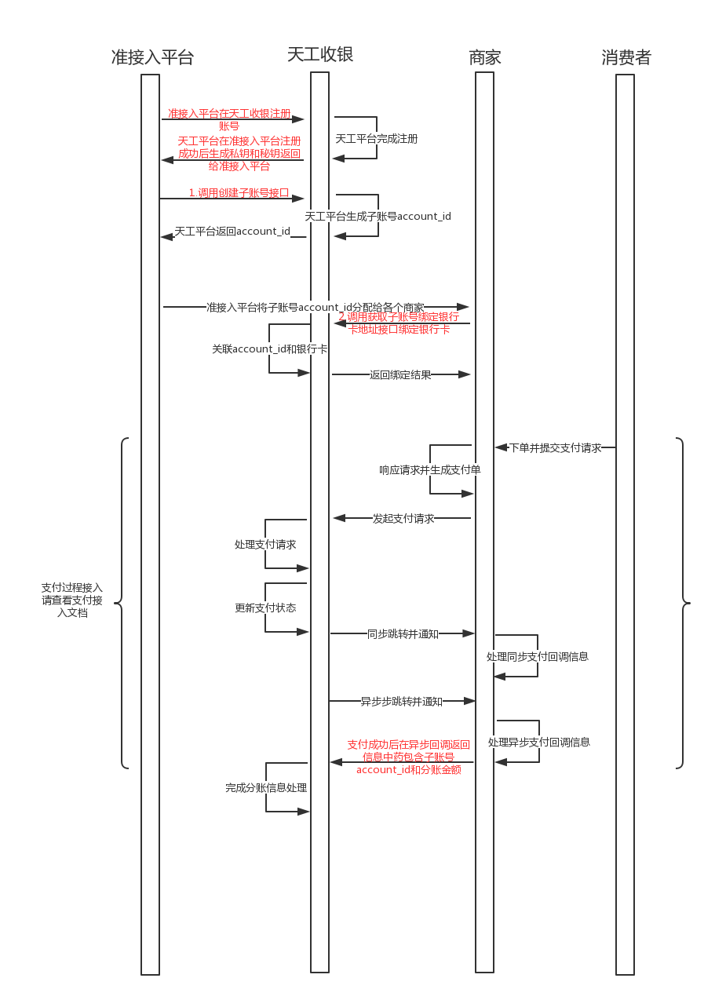
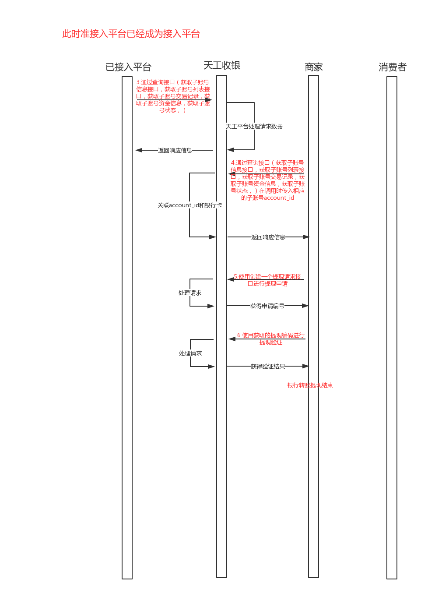

README
===========================
该文件用来展示天工收银子账号相关操作和手动分账相关操作

****
### Author:Roshan  
### E-mail:275509523@qq.com

===========================


##目录
* [时序图](#时序图)
* [子账号相关操作](#子账号相关操作)
    * [创建子账号接口](#创建子账号接口) account_create.php
    * [获取子账号信息接口](#获取子账号信息接口) account_get.php
    * [获取子账号列表接口](#获取子账号列表接口) account_list.php
    * [获取子账号交易记录](#获取子账号交易记录) account_jouranl_list.php
    * [获取子账号资金信息](#获取子账号资金信息) account_amount.php
    * [获取子账号状态](#获取子账号状态) account_status.php
    * [更新子账号信息](#更新子账号信息) account_update.php
    * [获取子账号绑定银行卡地址](#获取子账号绑定银行卡地址) bank_url_bind.php
    * [创建一个提现请求](#创建一个提现请求) withdrawal_create.php
    * [提现请求验证](#提现请求验证) withdrawal_confirm.php
    * [获取体现请求申请](#获取体现请求申请) withdrawal_list.php
    * [手动分账相关操作](#手动分账相关操作)
    * [手动分账](#手动分账) clearing_fzbprofit.php
    * [分账规则](#分账规则)

时序图
------------
具体接入流程介绍



创建子账号接口
----------
```php
<?php
$url = "http://api.teegon.com/v1/account/create";
$data = array(
    'client_id' => 'vk5pjq**********dyzb7xl',
    'client_secret' => 'lutiiwp*******64q7f4xal542a3',
    'name' => '凡刚宝宝',//  非必填参数
);
$data = http_build_query($data);
$ch = curl_init();
curl_setopt($ch,CURLOPT_HEADER,0);
curl_setopt($ch,CURLOPT_URL,$url);
curl_setopt($ch,CURLOPT_FRESH_CONNECT,1);
curl_setopt($ch,CURLOPT_RETURNTRANSFER,1);
curl_setopt($ch,CURLOPT_FORBID_REUSE,1);
curl_setopt($ch,CURLOPT_TIMEOUT,1);
curl_setopt($ch,CURLOPT_POST,1);
curl_setopt($ch,CURLOPT_POSTFIELDS,$data);
$re = curl_exec($ch);
curl_close($ch);
var_dump($re);

/**
返回值：
 string(289) "{
  "result": {
    "id": "a8b*******7e-45yl*******e",   //子账号主键id
    "account_id": "45y*******e",    //子账号唯一标识
    "domain_id": "a8b1*******e",     //主账号唯一标识
    "mobile": "",                //手机号
    "created": 1474617608,       //创建时间
    "bank_create_time": 0,
    "alias": "凡刚宝宝",         //昵称
    "cust_acct_id": "",
    "clearing_status": 0,        //清分状态
    "withdrawal_status": 0
  }
}"    */
```
获取子账号信息接口
----------
```php
<?php
$data = array(
    'client_id' => 'vk5pjqqwl*******zb7xl',
    'client_secret' => 'lutiiwp*******64q7f4xal542a3',
    'account_id' => 's178vzh6',  //非必填参数，无此参数时可获取client所对应的主账号信息
);
$data = http_build_query($data);
$url = "http://api.teegon.com/v1/account/get?".$data;
$ch = curl_init();
curl_setopt($ch,CURLOPT_HEADER,0);
curl_setopt($ch,CURLOPT_URL,$url);
curl_setopt($ch,CURLOPT_FRESH_CONNECT,1);
curl_setopt($ch,CURLOPT_RETURNTRANSFER,1);
//curl_setopt($ch,CURLOPT_FORBID_REUSE,1);
//curl_setopt($ch,CURLOPT_TIMEOUT,1);
//curl_setopt($ch,CURLOPT_POST,1);
//curl_setopt($ch,CURLOPT_POSTFIELDS,$data);
$re = curl_exec($ch);
curl_close($ch);
var_dump($re);

/**
返回值：
string(309) "{
  "result": {
    "id": "a8*******7e-nee*******x",           //子账号主键id
    "account_id": "neeh*******x",            //子账号唯一标识
    "domain_id": "a8b1*******7e",             //主账号唯一标识
    "mobile": "",                        //手机号
    "created": 1474616521,               //创建时间
    "bank_create_time": 1474616522,      //绑卡时间
    "alias": "neeha5tx",                 //昵称
    "cust_acct_id": "888100*******4881",   //银行对应的子账号id
    "clearing_status": 0,                //清分状态  0 开启 1 关闭
    "withdrawal_status": 0               //清分状态  0 开启 1 关闭
  }
}"
 */
 ```

获取子账号列表接口
----------
```php
$data = array(
    'client_id' => 'vk5pjqqw*******dyzb7xl',
    'client_secret' => 'lutiiwp*******64q7f4xal542a3',
    'offset' => '',//   非必填参数
    'limit'  => '',//   非必填参数
);
$data = http_build_query($data);
$url = "http://api.teegon.com/v1/account/list?".$data;
$ch = curl_init();
curl_setopt($ch,CURLOPT_HEADER,0);
curl_setopt($ch,CURLOPT_URL,$url);
curl_setopt($ch,CURLOPT_FRESH_CONNECT,1);
curl_setopt($ch,CURLOPT_RETURNTRANSFER,1);
//curl_setopt($ch,CURLOPT_FORBID_REUSE,1);
//curl_setopt($ch,CURLOPT_TIMEOUT,1);
//curl_setopt($ch,CURLOPT_POST,1);
//curl_setopt($ch,CURLOPT_POSTFIELDS,$data);
$re = curl_exec($ch);
curl_close($ch);
var_dump($re);

/**
返回值：
string(341) "{
  "result": [
    {
      "id": "a8*******7e-n*******5tx",                  //子账号主键id
      "account_id": "nee*******x",                   //子账号唯一标识
      "domain_id": "a8*******7e",                    //主账号唯一标识
      "mobile": "",                               //手机号
      "created": 1474616521,                      //创建时间
      "bank_create_time": 1474616522,             //绑卡时间
      "alias": "neeha5tx",                        //昵称
      "cust_acct_id": "888*******4881",          //银行对应的子账号id
      "clearing_status": 0,                       //清分状态  0 开启 1 关闭
      "withdrawal_status": 0                      //清分状态  0 开启 1 关闭
    }
  ]
}"
 */
```

获取子账号交易记录
----------
```php
<?php
$data = array(
    'client_id' => 'vk5pjqq*******b7xl',
    'client_secret' => 'lutiiwp*******64q7f4xal542a3',
    'journal_type'  => '',
    'out_order_no'  => '',
    'from_time'  => '',
    'to_lime'  => '',
    'offset'  => '',
    'limit'  => '',
);
$data = http_build_query($data);
$url = "http://api.teegon.com/v1/account/journal/list?".$data;
$ch = curl_init();
curl_setopt($ch,CURLOPT_HEADER,0);
curl_setopt($ch,CURLOPT_URL,$url);
curl_setopt($ch,CURLOPT_FRESH_CONNECT,1);
curl_setopt($ch,CURLOPT_RETURNTRANSFER,1);
//curl_setopt($ch,CURLOPT_FORBID_REUSE,1);
//curl_setopt($ch,CURLOPT_TIMEOUT,1);
//curl_setopt($ch,CURLOPT_POST,1);
//curl_setopt($ch,CURLOPT_POSTFIELDS,$data);
$re = curl_exec($ch);
curl_close($ch);
var_dump($re);

/**
返回值：
string(341) "{
    "result": {
    "Items": null,   //交易记录
    "Count": 0       //交易的总条数
  }
}"
 */
```

获取子账号资金信息
----------
```php
<?php
$data = array(
    'client_id' => 'vk5pjqqw*******sdyzb7xl',
    'client_secret' => 'lutiiwp*******64q7f4xal542a3',
    'account_id' => 'main',
);
$data = http_build_query($data);
$url = "http://api.teegon.com/v1/account/amount?".$data;
$ch = curl_init();
curl_setopt($ch,CURLOPT_HEADER,0);
curl_setopt($ch,CURLOPT_URL,$url);
curl_setopt($ch,CURLOPT_FRESH_CONNECT,1);
curl_setopt($ch,CURLOPT_RETURNTRANSFER,1);
//curl_setopt($ch,CURLOPT_FORBID_REUSE,1);
//curl_setopt($ch,CURLOPT_TIMEOUT,1);
//curl_setopt($ch,CURLOPT_POST,1);
//curl_setopt($ch,CURLOPT_POSTFIELDS,$data);
$re = curl_exec($ch);
curl_close($ch);
var_dump($re);

/*
string(80) "{
  "result": {
    "all_amount": 14232.88,
    "can_use_amount": 14232.88
  }
}"
*/
```

获取子账号状态
----------
```php
<?php
$data = array(
    'client_id' => 'vk5pjq*******dyzb7xl',
    'client_secret' => 'lutiiwp*******64q7f4xal542a3',
    'account_id'  => 'neeha5tx',
);
$data = http_build_query($data);
$url = "http://api.teegon.com/v1/account/status?".$data;
$ch = curl_init();
curl_setopt($ch,CURLOPT_HEADER,0);
curl_setopt($ch,CURLOPT_URL,$url);
curl_setopt($ch,CURLOPT_FRESH_CONNECT,1);
curl_setopt($ch,CURLOPT_RETURNTRANSFER,1);
//curl_setopt($ch,CURLOPT_FORBID_REUSE,1);
//curl_setopt($ch,CURLOPT_TIMEOUT,1);
//curl_setopt($ch,CURLOPT_POST,1);
//curl_setopt($ch,CURLOPT_POSTFIELDS,$data);
$re = curl_exec($ch);
curl_close($ch);
var_dump($re);

/**
返回值：
string(341) "{
"result": {
    "all_amount": 0,         //所有资金
    "bank_stauts": 0,        //绑卡状态
    "can_use_amount": 0,     //可提现金额
    "today_amount": null,    //当日资金
    "today_order": "0"       //当日订单数
  }
}"
 */
```

更新子账号信息
----------
```php
<?php
//此接口现在只能修改  昵称  alias
$url = "http://api.teegon.com/v1/account/update";
$data = array(
    'client_id' => 'vk5pjqqwl*******dyzb7xl',
    'client_secret' => 'lutiiwp*******64q7f4xal542a3',
    'account_id' => 'oahjmk2x',
    'alias' => '凡刚大宝宝',  //     非必填参数
);
$data = http_build_query($data);
$ch = curl_init();
curl_setopt($ch,CURLOPT_HEADER,0);
curl_setopt($ch,CURLOPT_URL,$url);
curl_setopt($ch,CURLOPT_FRESH_CONNECT,1);
curl_setopt($ch,CURLOPT_RETURNTRANSFER,1);
curl_setopt($ch,CURLOPT_FORBID_REUSE,1);
curl_setopt($ch,CURLOPT_TIMEOUT,1);
curl_setopt($ch,CURLOPT_POST,1);
curl_setopt($ch,CURLOPT_POSTFIELDS,$data);
$re = curl_exec($ch);
curl_close($ch);
var_dump($re);

/**
返回值：
string(20) "{
  "result": "ok"          // 是否更新成功
}"   */
```

获取子账号绑定银行卡地址
----------
```php
<?php
$url = "http://api.teegon.com/v1/bank/url/bind";
$data = array(
    'client_id' => 'vk5pjqq*******dyzb7xl',
    'client_secret' => 'lutiiwp*******64q7f4xal542a3',
    'account_id' => 'oa***2x',
    'notify_url' => 'www.baidu.com',
    'bind_type' => 'u',  // u b    非必填参数 默认 u
);
$data = http_build_query($data);
$ch = curl_init();
curl_setopt($ch,CURLOPT_HEADER,0);
curl_setopt($ch,CURLOPT_URL,$url);
curl_setopt($ch,CURLOPT_FRESH_CONNECT,1);
curl_setopt($ch,CURLOPT_RETURNTRANSFER,1);
curl_setopt($ch,CURLOPT_FORBID_REUSE,1);
curl_setopt($ch,CURLOPT_TIMEOUT,1);
curl_setopt($ch,CURLOPT_POST,1);
curl_setopt($ch,CURLOPT_POSTFIELDS,$data);
$re = curl_exec($ch);
curl_close($ch);
var_dump($re);

/*
返回值：
string(90) "{
  "result": "https://api.teegon.com/app/bank/bind_card?token=d7kfivhina4*******cmdifj"     //绑卡地址
}"
 */
```

创建一个提现请求
----------
```php
<?php
//$url = "http://api.test.teegon.ishopex.cn/v1/withdrawal/create";
$url = "http://api.teegon.com/v1/withdrawal/create";
$data = array(
    'client_id' => 'vk5pjqqwl*******dyzb7xl',
    'client_secret' => 'lutiiwp*******64q7f4xal542a3',
    'account_id' => '45ylrmje',
    'amount'    => 123,
    'card_id'   => 123,
);
$data = http_build_query($data);
$ch = curl_init();
curl_setopt($ch,CURLOPT_HEADER,0);
curl_setopt($ch,CURLOPT_URL,$url);
curl_setopt($ch,CURLOPT_FRESH_CONNECT,1);
curl_setopt($ch,CURLOPT_RETURNTRANSFER,1);
curl_setopt($ch,CURLOPT_FORBID_REUSE,1);
curl_setopt($ch,CURLOPT_TIMEOUT,1);
curl_setopt($ch,CURLOPT_POST,1);
curl_setopt($ch,CURLOPT_POSTFIELDS,$data);
$re = curl_exec($ch);
curl_close($ch);
var_dump($re);

/**
返回值：
 string(289) "{
  "result": {
      "transaction_no":823*******482,    //提现编号
  }
}"    */
```

提现请求验证
----------
```php
<?php
//$url = "http://api.test.teegon.ishopex.cn/v1/withdrawal/create";
$url = "http://api.teegon.com/v1/withdrawal/confirm";
$data = array(
    'client_id' => 'vk5pjqqwl*******sdyzb7xl',
    'client_secret' => 'lutiiwp*******64q7f4xal542a3',
    'transaction_no' => '9827*******2934',     //提现编号
    'verfiy_code'    => 98*******3,              //手机接收的验证码
);
$data = http_build_query($data);
$ch = curl_init();
curl_setopt($ch,CURLOPT_HEADER,0);
curl_setopt($ch,CURLOPT_URL,$url);
curl_setopt($ch,CURLOPT_FRESH_CONNECT,1);
curl_setopt($ch,CURLOPT_RETURNTRANSFER,1);
curl_setopt($ch,CURLOPT_FORBID_REUSE,1);
curl_setopt($ch,CURLOPT_TIMEOUT,1);
curl_setopt($ch,CURLOPT_POST,1);
curl_setopt($ch,CURLOPT_POSTFIELDS,$data);
$re = curl_exec($ch);
curl_close($ch);
var_dump($re);

/**
返回值：
 string(289) "{
  "result": {
  }
}"    */
```

获取体现请求申请
----------
```php
<?php
$data = array(
    'client_id' => 'vk5pjqqw*******yzb7xl',
    'client_secret' => 'lutiiwp*******64q7f4xal542a3',
    'account_id' => 'oa*******2x',
    'from_time' => '',
    'to_time' => '',
    'offset' => '',
    'limit' => '',
);
$data = http_build_query($data);
$url = "http://api.teegon.com/v1/withdrawal/list?".$data;
$ch = curl_init();
curl_setopt($ch,CURLOPT_HEADER,0);
curl_setopt($ch,CURLOPT_URL,$url);
curl_setopt($ch,CURLOPT_FRESH_CONNECT,1);
curl_setopt($ch,CURLOPT_RETURNTRANSFER,1);
//curl_setopt($ch,CURLOPT_FORBID_REUSE,1);
//curl_setopt($ch,CURLOPT_TIMEOUT,1);
//curl_setopt($ch,CURLOPT_POST,1);
//curl_setopt($ch,CURLOPT_POSTFIELDS,$data);
$re = curl_exec($ch);
curl_close($ch);
var_dump($re);

/*
返回值：
string(55) "{
  "result": {
    "Items": null,     // 各条分账信息
    "Count": 0         // 总条数
  }
}"
 */
```


手动分账
----------
```php
<?php
//进行分账的主账号一定要有延时分账的权限
// 参与分账的金额一定要与订单金额一致
$url = "http://api.teegon.com/v1/clearing/fzbprofit";
$a = array(
    0 =>
    array (
        'account_id' => 'main',
        'amount' => 100,     // amount
        'fee' => 20,         //大于  amount * 0.01   小于 amount 就好
        'comment' => '',
    ),
    1 =>
     array (
         'account_id' => 'gz*******l',
         'amount' => 0.01,
         'fee' => 0,
         'comment' => '',
     ),
    2 =>
    array (
        'account_id' => 'xpk*******e',
        'amount' => '0.08',
        'fee' => '0',
        'comment' => '',
    ),
);
$b =json_encode($a);
$data = array(
    'client_id' => 'vk5pjq*******sdyzb7xl',
    'client_secret' => 'ij3vgppsq*******p5wsux5yvnldzr',
    'charge_id'    =>'lutiiwp*******64q7f4xal542a3',   //charge_id
    'profit_content' => $b,
    );
$data = http_build_query($data);
$ch = curl_init();
curl_setopt($ch,CURLOPT_HEADER,0);
curl_setopt($ch,CURLOPT_URL,$url);
curl_setopt($ch,CURLOPT_FRESH_CONNECT,1);
curl_setopt($ch,CURLOPT_RETURNTRANSFER,1);
curl_setopt($ch,CURLOPT_FORBID_REUSE,1);
curl_setopt($ch,CURLOPT_TIMEOUT,1);
curl_setopt($ch,CURLOPT_POST,1);
curl_setopt($ch,CURLOPT_POSTFIELDS,$data);
$re = curl_exec($ch);
curl_close($ch);
var_dump($re);

/**
返回值：
string(20) "{
  "result": "ok"          // 是否更新成功
}"
*/
```

分账规则
----------
1. 分账数据中的 amount 总和  必须等于  订单的金额
2. 分账数据中的 fee 总和 不小于 订单应付的手续费
3. 每一组分账数据中 fee 不得大于 amount

规则说明：  
分账数据中必填参数有 `account_id`:账号 `amount`:分账金额 `fee`:手续费  
`account_id` 为`main`时  为主账号  
账号实际收到的分账金额为 `amount` 减去 `fee` 的结果  
 For example:
一笔100 的订单。客户支付成功，主账号main收到 100元，main的费率为 1% 。main下有两个子账号 分别为A和B，main要分给 A 30元 收10元手续费 B 20 元 无手续费 我们的分账数据如下  
```
array(
    0 =>
    array (
        'account_id' => 'main',
        'amount' => 50,     // amount
        'fee' => 0,         //大于  amount * 0.01   小于 amount 就好
        'comment' => '',
    ),
    1 =>
     array (
         'account_id' => 'A',
         'amount' => 30,
         'fee' => 10,
         'comment' => '',
     ),
    2 =>
    array (
        'account_id' => 'B',
        'amount' => 20,
        'fee' => '0',
        'comment' => '',
    ),
);
```
结果是  main 收到 49元（支付了1元的天工收付费） A 收到了 20元 （30 - 10） B 收到了 20元


For example:
一笔100 的订单。客户支付成功，主账号main收到 100元，main的费率为 1% 。main下有两个子账号 分别为A和B，main全部要分给 A 。我们的分账数据如下  
```
array(
    0 =>
    array (
        'account_id' => 'main',
        'amount' => 1,     // amount
        'fee' => 1,         //大于  amount * 0.01   小于 amount 就好
        'comment' => '',
    ),
    1 =>
     array (
         'account_id' => 'A',
         'amount' => 99,
         'fee' => 0,
         'comment' => '',
     ),

);
```
结果是  main 收到 0元（支付了1元的天工收付费） A 收到了 99元
